# AutoBot Navigation Simulation

## Overview

The **AutoBot Navigation Simulation** is a reinforcement learning-based simulation where multiple autobots navigate a grid to reach specified destinations while avoiding obstacles and each other. The system implements the Q-learning algorithm to help the autobots learn optimal paths through interaction with their environment.

## Features

- **Dynamic Grid**: Users can create a customizable grid with obstacles, starting points, and goal destinations using a GUI-based grid creator.
- **Reinforcement Learning**: Each autobot learns to navigate through the grid using the Q-learning algorithm, adjusting its strategy based on rewards and penalties.
- **Collision Avoidance**: The simulation includes mechanisms for avoiding collisions between autobots and obstacles.
- **Graphical User Interface**: A user-friendly GUI allows for easy grid creation and visualization of autobot movements.
- **Automatic and Manual Simulator**: The simulator supports automatic execution of movements as well as manual debugging for fine-tuning.
- **Deadlock Handling**: The system includes mechanisms to detect and resolve deadlocks during navigation.
- **Multiple Bots Creation**: Users can create and manage multiple autobots in the simulation.
- **Performance Tracking**: The simulation tracks time, command execution, and steps taken by each autobot.


## Requirements

Make sure you have the following installed:

- Python 3.x
- Tkinter (usually comes with Python)
- NumPy

## Installation

1. Clone the repository or download the `autobot.py` file.
2. Install Requirements library
   ```bash
     pip install -r requirements.txt

3. Navigate to the directory containing `autobot.py` in your terminal or command prompt.
4. Run the script using:
   ```bash
   python autobot.py

## Demonstration
- Provide grid size as input (n x n).

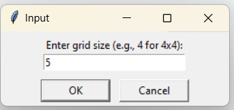

### The Grid Creator window has two features: one for adding obstacles and another for setting bot starting and ending points. 
- If we click the left mouse button, an obstacle (black box) will be added.
- If we click the right mouse button, the first click will add the starting point (blue), and the second click will add the ending point (yellow).
- 
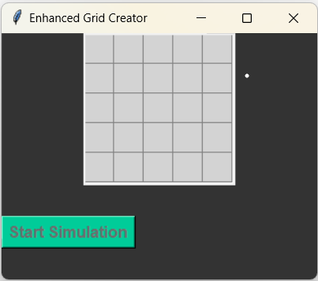


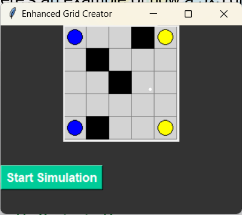

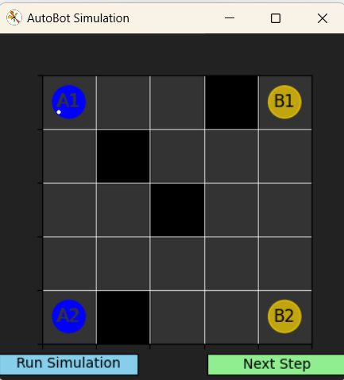

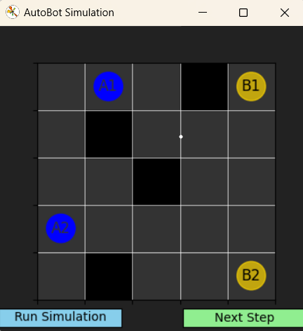

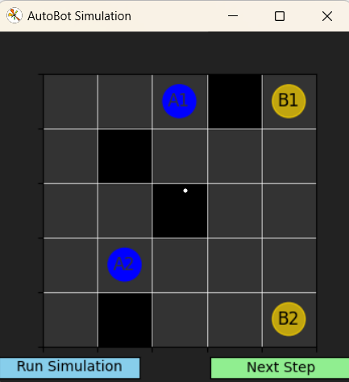

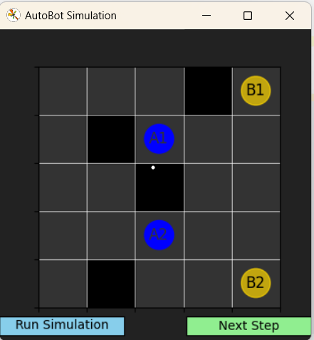

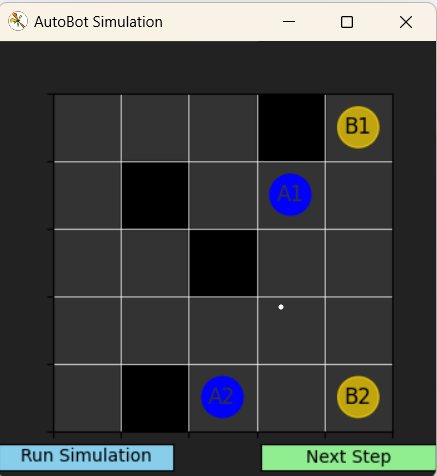

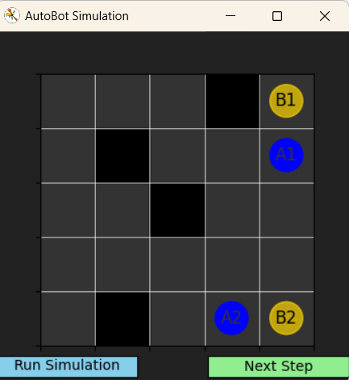

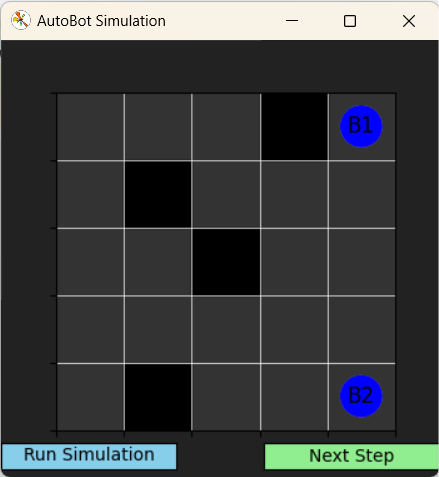

### Terminal Output

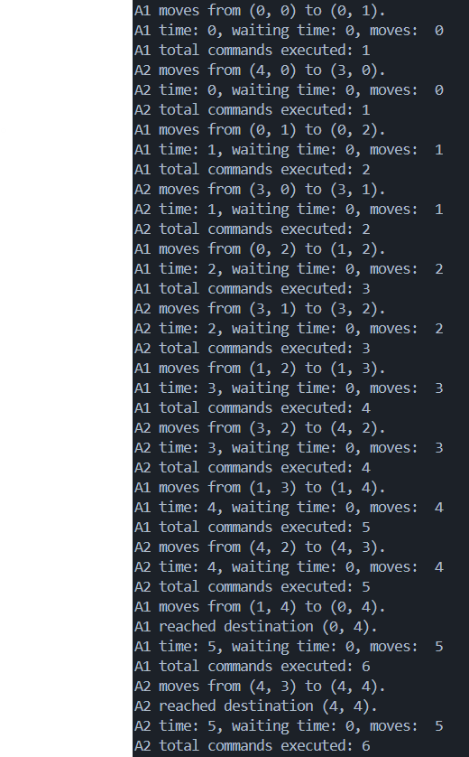
